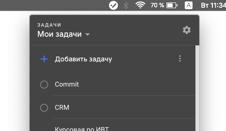

# google-tasks-desktop
Desktop version of Google Tasks

I just tried to create desktop version of Google Tasks using electron. It simply displays Gmail web version of Google Tasks.

## Contribute

To run it locally on your own computer:

* [Fork](https://help.github.com/articles/fork-a-repo/) this repository
* [Clone](https://help.github.com/articles/cloning-a-repository/) it to your
  local device
* [Install](https://yarnpkg.com/en/docs/cli/install) the dependencies
* Run it using `npm start`

